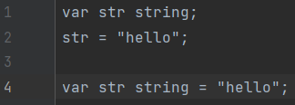

# How to start

## 1. Create a new project
Create a new file with the extension `.ecla`.

## 2. Run your program
To run your program which is empty for the moment, use the following command `Ecla filename`.  
In our example, you will do : `Ecla .\HowToStart\empty.ecla` and have the following result :  

## 3. Create a variable

### Different types
First you need to know that several types exist in Ecla for your variables.  
Here is a list of all of them : `bool, float, int, string, list, map`

### Creation
Something important to know before you start to code, like in others languages (C, Java or JavaScript) you need to finish your line by `;`.  
The purpose of this is to announce the end of line.  
Now that you know the types, we will create our first variable.  
To create it you will always use the same syntax : `var varName type;`.
Then to define a value to your variable, you will use : `varName = value;`  
You can also define the variable with its value directly with : `var varName type = value;`

### Example
In our example, we will create a `string` variable named `str` which contains `hello`.  
As said above, it doesn't matter which method you use to create the variable.
Use the one you are more convenient with.
  
If you try to run this program : `Ecla .\HowToStart\var.ecla`.  
You will have the same result as previously because we are still not printing our variable.

## 4. Print
To print in Ecla you will have to use one of our standard library, console.

### Import a library
To start, you will have to import the library by using the keyword `import` followed by the library name.  
So in our case to import the library console, you will write : `import console;`.

### Use a library
Now that our library is imported in our code, we will be able to use it.  
To use a function from a library, you will use the following syntax : `libraryName.functionName();`

### Example
Here we want to print our variable `str`. To do so we will use the function `print` from the library console.  
  
If you execute the program `print.ecla`, it will print the value of the variable str in your terminal like this :  
  
Well done you did your first Hello, World! in Ecla!  
_Here we printed the value of a variable, but you can also print a value directly._

## 5. Create your first function

### Creation
Now you know how to create a variable and use a library to print it.
Let's advance to the next step and create a function.  
For this you will need a new keyword `function`.  
To create your function, you will use this syntax : `function functionName() {}`. Then you write your code between the braces.

### Call
If you just create your function and execute your program, it won't print anything because the code in your function
is never executed because your function is never called.  
So to call your function, you simply write the name of your function `functionName();`.

### Example
We will reuse our previous code but put in a function named `hello` and called it like this :  
  
It will give you the same result as before.

## 6. Function parameters
You learned how to create and call a function but if you want to change the value printed, you will have to change the function itself.  
Instead you can use parameters for your function to print whichever value you want.  
To make your function takes one or more parameters, you will define it between the parenthesis `functionName(varName : varType, var2Name : var2Type) {}`.

### Example
For this example we will add 2 `string` parameters to our function hello then print the 2 values.  
You can see bellow the program and the result expected :  
 

## 7. Return a value

### Return a value from a function
Until now our function was used to print a string but what about creating a function to add a number to another one ?  
So instead of printing, you will return your value using the keyword `return`.  
At first, you need to define the type you want to return from your function after your parameters' parenthesis,
you need to open new parenthesis where your precise the type returned like this : `funcName(var : type) (int) {}`.  
Secondly, at the end of your function you put your return followed by the value wanted like this : `return value;`.

### Example
We create a function add which takes 2 int parameters and return the addition of both (in this case an int).  
Then in another function main, you define 2 variables, call the function add with this 2 variables and print the result.  
 