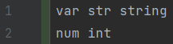
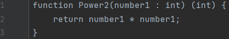
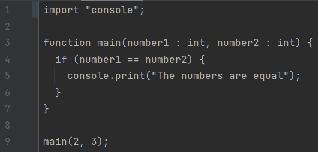
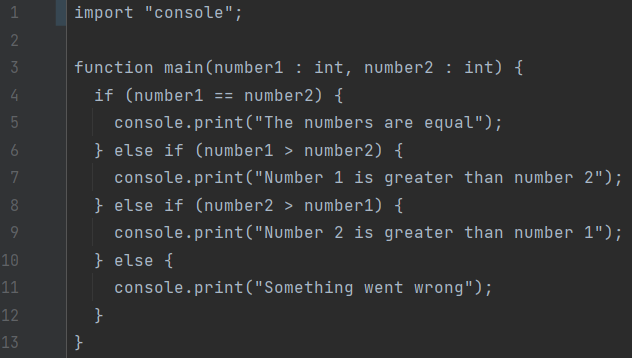
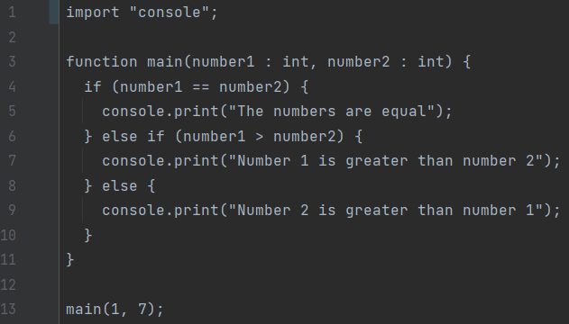
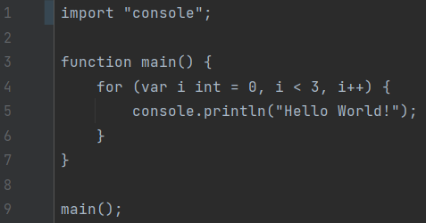
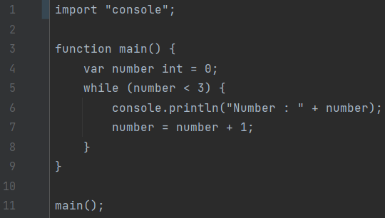

# How to start

## 0. Get ready to use ecla
Go on this link: https://github.com/Eclalang/Ecla/releases
and pick your desired Ecla version.

You should have an `ecla.exe`.
Add this file to your environement variable of your computer.

Ecla is now usable on your device.
## 1. Create a new project
Create a new file with the extension `.ecla`.

our file will be named `file.ecla` for this learning class.
## 2. Run your program
To run your program which is empty for the moment, use the following command `Ecla filename`.  
In our example, you will do : `Ecla .\HowToStart\empty.ecla` and have the following result :  


our commmand line:

`Ecla run file.ecla`
## 3. Create a variable

### What is a type ?
A type is a way to define the nature of your variable.
For example, if you want to store a number, you will use the type `int` or `float` depending on the usage you want.  
There is a multitude of types, you will learn them in the next section.

### Different types
First you need to know that several types exist in Ecla for your variables.  
Here is a list of all of them : `bool, float, int, char , string, list, map`

`bool: store a boolean value (true | false)`

`float: store a decimal number (11.0 | 0.43 | -1.3 | ...)`

`int: store an integer (11 | 0 | -2 | ...)`

`char: store an alphabetic letter or symbol (character) ('a' | '1' | ')' | ...)`

`string: store set of character ("aa" | "12" | "UwU" | ...)`

`list: store set of variable`

`string: store set of variable, annexable with an othe variable`

### Creation
Now that you know the types, we will create our first variable.  
To create it you will always use the same syntax : `var varName type;`.

### Example
In our example, we will create a `string` variable named `str` and some others variables with different types.  
  
If you try to run this program, you will have an error because you didn't use the right syntax.
Something important to know, like in others languages (C, Java or JavaScript) you need to finish your line by `;`.  
The purpose of this is to announce the end of line.  
To fix it, you will have to add a `;` at the end of your first line and specify that `num` is a variable like this :  
  
If you try to run this program : `Ecla .\HowToStart\varCreation.ecla`.  
You will have the same result as previously because our variables don't have a value assigned.

## 4. Assign a value to a variable

### Assign a value
Now that you know how to create a variable, you will have to assign a value to it.
Then to define a value to your variable, you will use : `varName = value;`  
You can also define the variable with its value directly with : `var varName type = value;`

### Example
In our example, we will assign a text to our variable `str` and a number to our variable `nb`.  
  
If you try to run this program : `Ecla .\HowToStart\varAssign.ecla`.  
You will have the same result as previously because our variable is still not printed.

## 5. Print
Until now, you learned how to create a variable and assign a value to it. But you can't see the progression of your program.  
So what we are going to do is print the value of our variable.  
To print in Ecla you will have to use one of our standard library, console.

### Import a library
To start, you will have to import the library by using the keyword `import` followed by the library name.  
So in our case to import the library console, you will write : `import "console";`.

### Use a library
Now that our library is imported in our code, we will be able to use it.  
To use a function from a library, you will use the following syntax : `libraryName.functionName();`

### Example
Here we want to print our variable `str`. To do so we will use the function `print` from the library console.  
  
If you try to run this program : `Ecla .\HowToStart\print.ecla`, it will print the value of the variable str in your terminal like this :  
  
Well done you did your first Hello, World! in Ecla!  
_Here we printed the value of a variable, but you can also print a value directly._

## 6. Create your first function

### What is a function ?
A function is a block of code where multiple instructions are grouped together.  
It can be called as many times as you want from anywhere in your program.

### Creation
Now you know how to create a variable and use a library to print it.
Let's advance to the next step and create a function.
For this you will need a new keyword `function`.  
To create your function, you will use this syntax : `function functionName() {}`. Then you write your code between the braces.

### Call
If you just create your function and execute your program, it won't print anything because the code in your function
is never executed because your function is never called.  
So to call your function, you simply write the name of your function `functionName();`.

### Example
We will reuse our previous code but put in a function named `hello` and called it like this :  
  
If you try to run this program : ```Ecla .\HowToStart\hello.ecla```  
It will give you the same result as before.  
If you call your function multiple times, it will print the same value multiple times. Here I called it 2 times :  

  
And I ended up with 2 times the same value printed.

## 7. Function parameters
You learned how to create and call a function but if you want to change the value printed, you will have to change the function itself.  
Instead you can use parameters for your function to print whichever value you want.  
To make your function takes one or more parameters, you will define it between the parenthesis `functionName(varName : varType, var2Name : var2Type) {}`.

### Example
For this example we will add 2 `string` parameters to our function hello then print the 2 values.  
You can see bellow the program and the result expected :  
   
You can try to run this program yourself : ```Ecla .\HowToStart\parameters.ecla```.

## 8. Dynamic import

### What is a dynamic import ?
A dynamic import is a way to import functions from a .ecla file.  
It is useful when you want to use a function from another file without having to copy it in your current file.  

### How to use it ?
To use a dynamic import, you will have to use the keyword `import` followed by the path of the file you want to import, like this :  
`import "path/to/file.ecla";`.  
And to use your function you will have to use the following syntax : `libraryName.functionName();`.

### Example
We will create a function Power2 in a file named `fileToImport.ecla` and import it in our main file.  
You can try to run this program : ```Ecla .\HowToStart\dynamicImport.ecla```  
  


## 9. Return a value

### Return a value from a function
Until now our function was used to print a string but what about creating a function to add a number to another one ?  
So instead of printing, you will return your value using the keyword `return`.  
At first, you need to define the type you want to return from your function after your parameters' parenthesis,
you need to open new parenthesis where your precise the type returned like this : `funcName(var : type) (int) {}`.  
Secondly, at the end of your function you put your return followed by the value wanted like this : `return value;`.

### Example
We create a function add which takes 2 int parameters and return the addition of both (in this case an int).  
Then in another function main, you define 2 variables, call the function add with this 2 variables and print the result.  
You can try to run this program : ```Ecla .\HowToStart\return.ecla```  
 

## 10. Return multiple values

### Return multiple values from a function
You learned how to return a value from a function but what if you want to return multiple values ?  
If you understood the previous section, it will be easy for you.  
To return multiple values from a function, you will have to define the types returned between the parenthesis : `funcName(varName : vartype) (int, string) {}`.  
Then you will have to return the values separated by a comma like this : `return value1, value2;`.

### Example
We will reuse our previous example but instead of returning an int, we will return 2 int.  
One will be the addition of the 2 parameters and the other one will be the subtraction of the 2 parameters.  
   
As you can see, I added text to the print to know which value is which.  
You can try to run this program : ```Ecla .\HowToStart\multipleReturn.ecla``` if you want to see the result.  
In the function print, you can add as many values as you want separated by a plus sign and if you add `"\n"` at the end, it will add a new line after printing the values.  
Which could be useful to have a better display.  
_You can also use the function `println` in the console library to print a new line at the end of your print directly._

## 11. Conditions

### Simple Condition
Let's say you want to print a text if a condition is true.  
To do so, you will use the keyword `if` followed by the condition between parenthesis and braces : `if (condition) {code}`.  
If the condition is true, the code between the braces will be executed.  
If the condition is false, the code between the braces will be ignored.

### Example Simple Condition
In our example, we will print a text if two variables are equal.  
First case if the variables are equal :  

  
Second case if the variables are not equal :  



### Condition with else
Now let's say you want to print a text if a condition is true and another text if the condition is false.  
Otherwise you will have to write 2 if with the opposite condition.  
To avoid this, you can use the keyword `else` after your first if.

### Example Condition with else
In our example, we will print a text if two variables are equal and another text if the variables are not equal.  
First case if the variables are equal :  

  
Second case if the variables are not equal :  


### Condition with else if
The problem with only if and else is that you can only have 2 cases.
So if you have more than 2 cases, you will have to write multiple if and else.  
To avoid this, you can use the keyword `else if` after your first if.

### Example Condition with else if
In our example, we will print a text if two variables are equal, another text if the first variable is greater than the second one and another text if the second variable is greater than the first one.  
Our function will take 2 int parameters and return a string like this :  
  
First case if the variables are equal :  

  
Second case if the first variable is greater than the second one :  

  
Third case if the second variable is greater than the first one :  

  
In this example, at least one of the 3 cases will be always true, so it won't execute the else part.  
So instead of using 2 `else if` statement, you can use an `else` statement to replace the last `else if` statement :  

  
_As you saw earlier, you can use as many else if statement as you want._

## 12. Loops
Let's introduce the loops.  
Loops are used to execute a code multiple times.  
There are 3 types of loops : `for`, `for range` and `while`.

### For loop
The for loop is used to execute a code a specific number of times.  
To use a for loop, you will have to define a variable, a condition and an incrementation.  
The variable will be used to know how many times the code will be executed.  
To define a for loop, you will use the keyword `for` followed by the variable, the condition and the incrementation between parenthesis and braces : `for (var, condition, incrementation) {code}`.

### Example For loop
In our example, we will print a text 3 times :  



### For range loop
The for range loop is used to execute a code for each element of a list.  
To use a for range loop, you will have to define a list.  
To define a for range loop, you will use the keyword `for` followed by two variables which will be used as key and value variables, then the keyword `range` and the list between parenthesis and the code to execute between braces : `for (key, value range list) {code}`.

### Example For range loop
In our example, we will print each key and value from a list :  

  
_In a list, the first value is always at the index 0._

### While loop
The while loop is used to execute a code while a condition is true.  
To use a while loop, you will have to define a condition.  
To define a while loop, you will use the keyword `while` followed by the condition between parenthesis and braces : `while (condition) {code}`.

### Example While loop
In our example, we will print a text while a variable is lesser than 3 :  

  
_The variable is incremented in the code to avoid an infinite loop._
